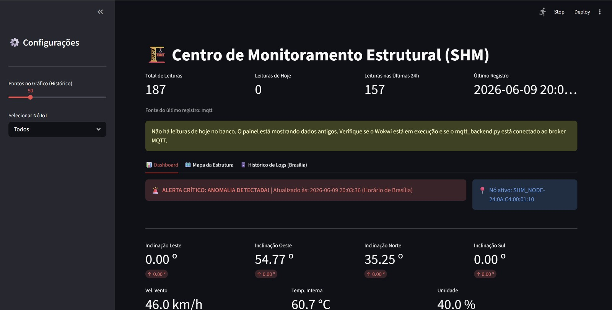
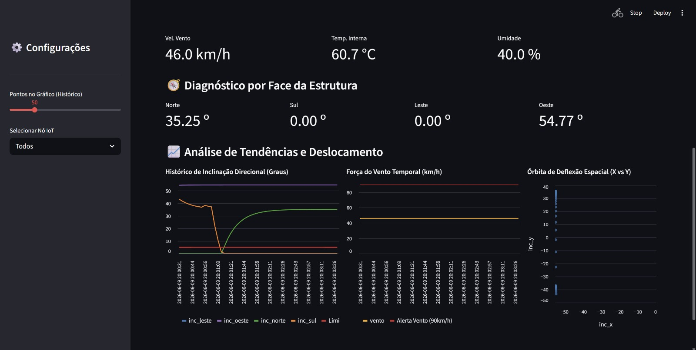
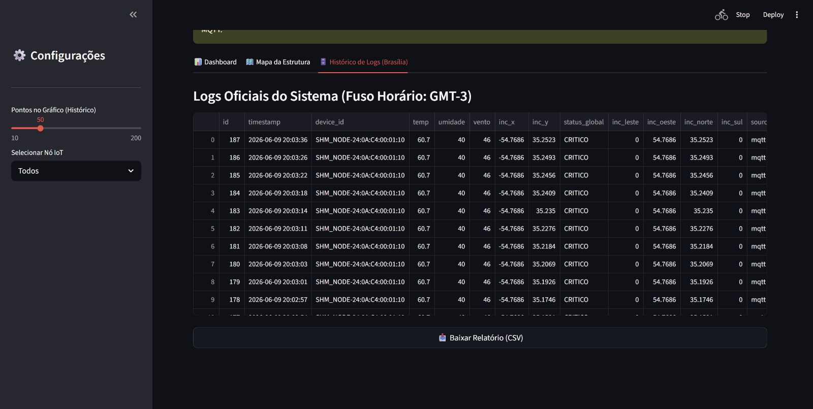
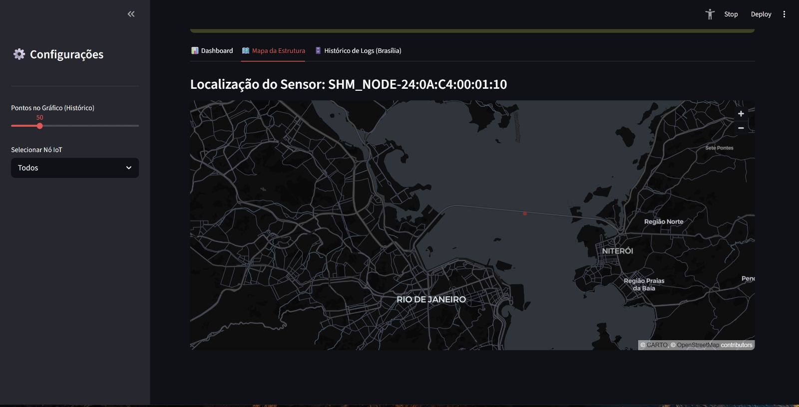
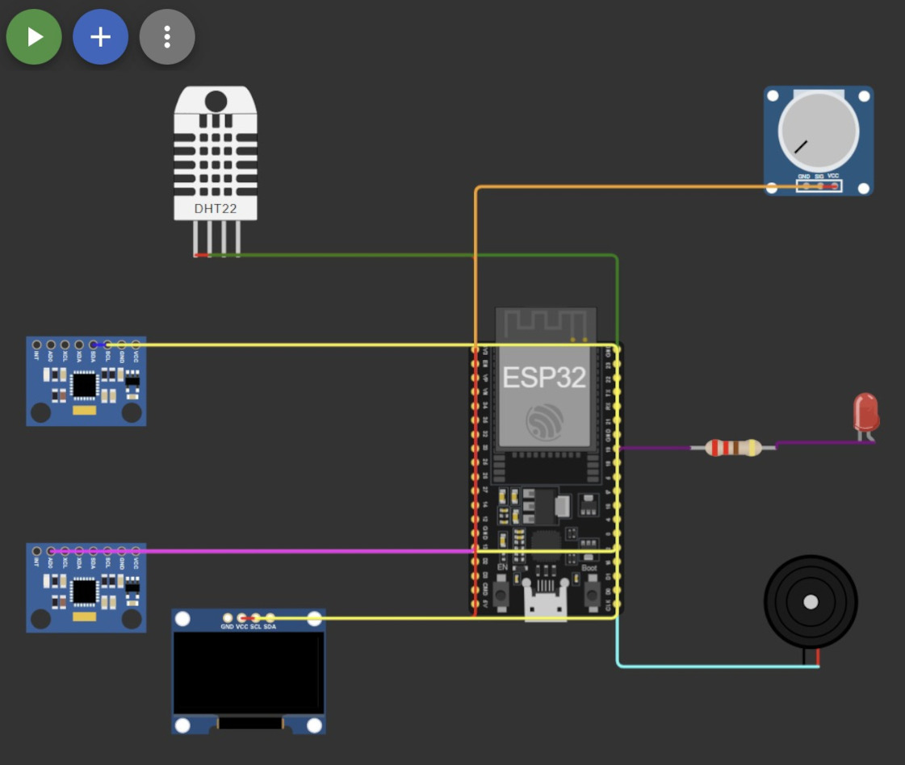

## Telas do Sistema

### Dashboard



### Gráficos e monitoramento



### Logs dos sensores



### Localização dos sensores



### Simulação IoT (Wokwi)


# SHM IoT - Monitoramento Estrutural com Wokwi

Sistema de monitoramento estrutural com ESP32 no Wokwi, MQTT, backend Python, SQLite e dashboard Streamlit.

O projeto mede inclinacao em dois eixos, temperatura, umidade e vento simulado. Quando algum limite e ultrapassado, o ESP32 aciona LED/buzzer, mostra o estado no OLED e publica o status no MQTT.

## Fluxo de producao

```text
Wokwi / ESP32
  -> publica JSON no MQTT
broker.emqx.io:1883
  -> topico shm/projeto_arthur/sensores
mqtt_backend.py
  -> grava no SQLite
shm_database.db
  -> lido pelo dashboard.py
Streamlit
  -> http://localhost:8501
```

Para o fluxo principal, o backend MQTT e necessario. O Streamlit nao recebe dados direto do Wokwi; ele le o banco SQLite que o backend atualiza.

`main.py` e uma API FastAPI opcional para testes HTTP. Nao e necessario para rodar o projeto com Wokwi em producao.

## Arquivos usados em producao

| Arquivo | Uso |
| --- | --- |
| `sketch.ino` | Firmware do ESP32 no Wokwi. Le sensores, calcula inclinacao em graus, publica MQTT e atualiza OLED/alertas. |
| `diagram.json` | Montagem Wokwi com ESP32, DHT22, 2 MPU6050, potenciometro, LED, buzzer e OLED. |
| `libraries.txt` | Bibliotecas Arduino necessarias para compilar no Wokwi. |
| `mqtt_backend.py` | Backend obrigatorio para receber MQTT e salvar no SQLite. |
| `dashboard.py` | Dashboard Streamlit que atualiza a tela a cada 3 segundos. |
| `requirements.txt` | Dependencias Python. |
| `shm_database.db` | Banco SQLite local. Se nao existir, o backend cria automaticamente. |

Arquivo opcional:

| Arquivo | Uso |
| --- | --- |
| `main.py` | API FastAPI opcional para testes ou integracao HTTP. |

## Componentes do Wokwi

O projeto deve ter 2 sensores MPU6050:

| Componente | Configuracao |
| --- | --- |
| ESP32 DevKit C v4 | Placa principal |
| DHT22 | `GPIO 15` |
| Potenciometro de vento | `GPIO 34` |
| LED vermelho | `GPIO 4` com resistor de 220 ohms |
| Buzzer | `GPIO 5` |
| MPU6050 Leste/Oeste | I2C `GPIO 21/22`, endereco `0x68` |
| MPU6050 Norte/Sul | I2C `GPIO 21/22`, endereco `0x69`, pino `AD0` ligado em `3V3` |
| OLED SSD1306 | I2C `GPIO 21/22`, endereco padrao `0x3C` |

No codigo:

- `inclinacao_x`: eixo Leste/Oeste.
- `inclinacao_y`: eixo Norte/Sul.
- Valores positivos em `x`: Leste.
- Valores negativos em `x`: Oeste.
- Valores positivos em `y`: Norte.
- Valores negativos em `y`: Sul.

## Intervalo de atualizacao

O sistema foi configurado para 3 segundos:

| Camada | Configuracao |
| --- | --- |
| ESP32/Wokwi | `LOOP_INTERVAL_MS = 3000` em `sketch.ino` |
| Backend demo/fallback | `DEMO_INTERVAL_SECONDS = 3` em `mqtt_backend.py` |
| Dashboard | `REFRESH_SECONDS = 3` em `dashboard.py` |

O ESP32 tambem envia no JSON:

```json
{
  "uptime_ms": 123456,
  "intervalo_ms": 3000
}
```

## Pre-requisitos

- Python 3.10 ou superior
- Navegador web
- Wokwi online ou extensao Wokwi no VS Code
- Internet liberada para `broker.emqx.io:1883`

## Instalar dependencias Python

### Windows PowerShell

```powershell
python -m venv .venv
.\.venv\Scripts\Activate.ps1
python -m pip install --upgrade pip
pip install -r requirements.txt
```

Se o PowerShell bloquear a ativacao:

```powershell
Set-ExecutionPolicy -Scope CurrentUser RemoteSigned
```

Depois feche e abra o terminal novamente.

### macOS / Linux

```bash
python3 -m venv .venv
source .venv/bin/activate
python -m pip install --upgrade pip
pip install -r requirements.txt
```

## Configurar e rodar no Wokwi

1. Abra o projeto no Wokwi.
2. Copie o conteudo atualizado de `sketch.ino` para o sketch.
3. Copie o conteudo de `diagram.json` para o diagrama.
4. Copie o conteudo de `libraries.txt` para as bibliotecas.
5. Confirme o WiFi do Wokwi no sketch:

```cpp
#define WIFI_SSID "Wokwi-GUEST"
#define WIFI_PASS ""
```

6. Confirme o broker e topico:

```cpp
const char *mqtt_server = "broker.emqx.io";
const char *mqtt_topic = "shm/projeto_arthur/sensores";
```

7. Clique em `Start Simulation`.
8. Abra o Serial Monitor do Wokwi.

Saida esperada:

```text
WiFi conectado!
MQTT conectado!
MQTT publish: OK
MQTT conectado: SIM
MQTT state: 0
Payload bytes: ...
```

Essas mensagens devem repetir a cada aproximadamente 3 segundos.

Se aparecer `MQTT publish: FALHOU`, veja no Serial Monitor:

- `MQTT conectado`
- `MQTT state`
- `Payload bytes`

## Rodar o backend MQTT

Abra um terminal na pasta do projeto:

### Windows

```powershell
.\.venv\Scripts\Activate.ps1
python mqtt_backend.py
```

### macOS / Linux

```bash
source .venv/bin/activate
python mqtt_backend.py
```

Terminal esperado:

```text
MQTT conectado e inscrito no topico shm/projeto_arthur/sensores.
[2026-06-09 19:40:56] Dados salvos | Status: SEGURO
```

Mantenha esse terminal aberto.

## Rodar o dashboard

Abra outro terminal na pasta do projeto:

### Windows

```powershell
.\.venv\Scripts\Activate.ps1
python -m streamlit run dashboard.py
```

### macOS / Linux

```bash
source .venv/bin/activate
python -m streamlit run dashboard.py
```

Abra:

```text
http://localhost:8501
```

O dashboard deve atualizar automaticamente a cada 3 segundos.

## Ordem correta para demonstracao

1. Rodar a simulacao no Wokwi.
2. Conferir no Serial Monitor: `MQTT publish: OK`.
3. Rodar `python mqtt_backend.py`.
4. Rodar `python -m streamlit run dashboard.py`.
5. Abrir `http://localhost:8501`.

## Payload MQTT esperado

```json
{
  "device_id": "SHM_NODE-XX:XX:XX:XX:XX:XX",
  "uptime_ms": 123456,
  "intervalo_ms": 3000,
  "ambiente": {
    "temperatura": 25.0,
    "umidade": 60.0,
    "vento_kmh": 35.0
  },
  "estrutura": {
    "inclinacao_x": 1.2,
    "inclinacao_y": -0.4,
    "inclinacao_leste": 1.2,
    "inclinacao_oeste": 0.0,
    "inclinacao_norte": 0.0,
    "inclinacao_sul": 0.4
  },
  "alertas": {
    "status_global": "SEGURO"
  }
}
```

## Limites de alerta

| Medida | Limite |
| --- | --- |
| Inclinacao X ou Y | maior que `5.0` graus |
| Vento | maior que `90 km/h` |
| Temperatura | maior que `45 C` |

Se qualquer limite for ultrapassado, `status_global` vira `CRITICO`.

## Banco de dados

Arquivo:

```text
shm_database.db
```

Tabela:

```text
leituras
```

Campos principais:

- `timestamp`
- `device_id`
- `temp`
- `umidade`
- `vento`
- `inc_x`
- `inc_y`
- `inc_leste`
- `inc_oeste`
- `inc_norte`
- `inc_sul`
- `status_global`
- `source`

Valores de `source`:

- `mqtt`: dado real recebido do Wokwi via MQTT.
- `demo`: dado local gerado pelo backend se o broker estiver indisponivel.
- `api`: dado recebido pela API opcional.

Para producao/demonstracao real, use registros com `source = mqtt`.

## Verificacoes rapidas

Verificar dependencias:

```bash
python -c "import streamlit, pandas, paho.mqtt.client; print('OK')"
```

Verificar sintaxe:

```bash
python -m py_compile mqtt_backend.py dashboard.py main.py
```

Ver ultimas leituras no banco:

```bash
python -c "import sqlite3; c=sqlite3.connect('shm_database.db'); print(c.execute('select id,timestamp,source,device_id from leituras order by id desc limit 10').fetchall()); c.close()"
```

Monitorar o topico MQTT por alguns segundos:

```bash
python -c "import time,paho.mqtt.client as mqtt; t='shm/projeto_arthur/sensores'; c=mqtt.Client(mqtt.CallbackAPIVersion.VERSION2); c.on_connect=lambda c,u,f,r,p=None:(print('connected',r),c.subscribe(t)); c.on_message=lambda c,u,m:print(m.payload.decode()[:300]); c.connect('broker.emqx.io',1883,10); c.loop_start(); time.sleep(15); c.loop_stop(); c.disconnect()"
```

## Problemas comuns

### Dashboard nao atualiza

Verifique:

- Wokwi esta rodando.
- Serial Monitor mostra `MQTT publish: OK`.
- `mqtt_backend.py` esta rodando.
- O topico no sketch e no backend e exatamente `shm/projeto_arthur/sensores`.
- O Streamlit foi aberto em `http://localhost:8501`.

### Backend esta rodando, mas nao entram dados do Wokwi

Monitore o Serial Monitor:

- `MQTT conectado: SIM`
- `MQTT state: 0`
- `MQTT publish: OK`

Se `publish` falhar, confira internet do Wokwi, broker, topico e tamanho do payload.

### Aparecem dados demo

O backend gera demo quando nao esta conectado ao broker. Para demonstracao real, confirme que chegaram linhas `source = mqtt`.

### Wokwi nao conecta no WiFi

Use exatamente:

```cpp
#define WIFI_SSID "Wokwi-GUEST"
#define WIFI_PASS ""
```

### Wokwi nao compila

`libraries.txt` deve conter:

```text
DHT sensor library
Adafruit MPU6050
Adafruit Unified Sensor
ArduinoJson
PubSubClient
Adafruit GFX Library
Adafruit SSD1306
```

### Porta do Streamlit em uso

```bash
python -m streamlit run dashboard.py --server.port 8502
```

## API opcional

A API FastAPI nao faz parte do fluxo principal com Wokwi. Use apenas se precisar testar envio HTTP.

Rodar:

```bash
python -m uvicorn main:app --reload --host 0.0.0.0 --port 8000
```

Teste:

```text
http://localhost:8000/health
```

## Autor

Arthur - Projeto Faculdade
